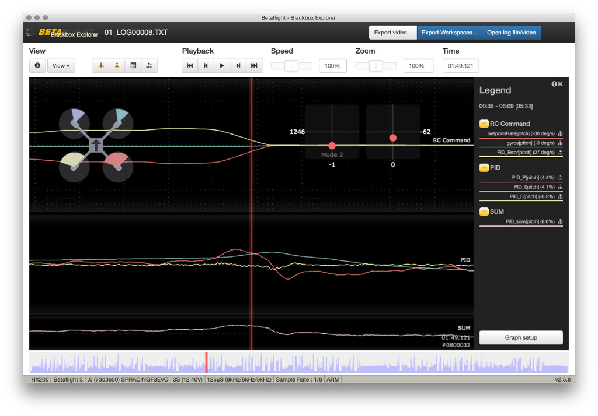
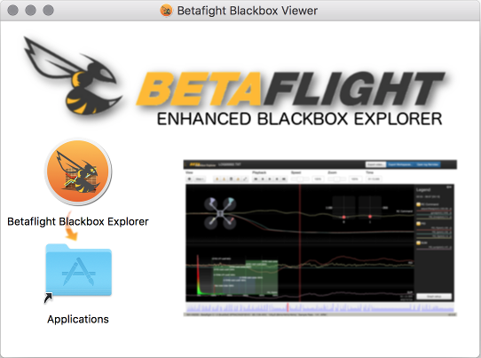
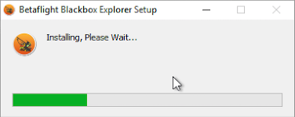

# Betaflight Enhanced Blackbox Explorer

This tool allows you to open logs recorded by Betaflight's Blackbox feature as a native application. You can seek through the log to examine graphed values at each timestep. If you have a flight video, you can load that in as well and it'll be played behind the log.

## Installation

The application can be installed in a number of ways:-

### As a Google Chrome Web Application / Extension

_The Google Chrome App is soon going to be obsolete and unavailable_; the following is only applicable upto and including v2.5.8

1. Automatically, As a Chrome Web Store App (soon to be depreciated). Go to the [Chrome Web Store](https://chrome.google.com/webstore/search/betaflight) and install the extension.
1. Manually, As a unpacked Chrome extension; download (and unzip) the **/app** folder to your local machine, then goto the [Extension Manager](chrome://extensions/). Ensure Developer Mode is ticked, then select "Load Unpacked Extension"; choose the folder where you downloaded the **/app** folder to.
1. Manually, As a Web Page, download (and unzip) the **/app** folder to your local machine, then in chrome, open the index.html file.

`v2.5.8 is the last version to support the Google Chrome Store; USE THE FOLLOWING METHOD FOR v2.5.8 ONWARDS`

### As Native Windows or MacOS Application,

#### For MacOS

1. Download the current .DMG file from the **/install/osx** folder.
1. Open the .DMG file and drag the icon to the application folder.

#### For Windows

1. Download the current setup.exe file from the **/install/win/x32** or **/install/win/x64** folder. The _x32_ or _x64_ are 32bit or 64bit versions of the software; be sure to download the correct one for your operating system.
1. Run the Setup.exe file.

The installer will complete and put an icon in your start menu and/or on the desktop

#### For linux
A linux installer is not supported yet;

## Known Issues
1. Video export is not supported yet on the native applications.

## Credits
This project is a derivative of the outstanding work carried out originally by TheNickDude on the vanilla Cleanflight Blackbox Explorer.

Many individuals in the community have helped develop, test and maintain this project, there help is greatly appreciated.
## License

This project is licensed under [GPLv3.](LICENSE.md)